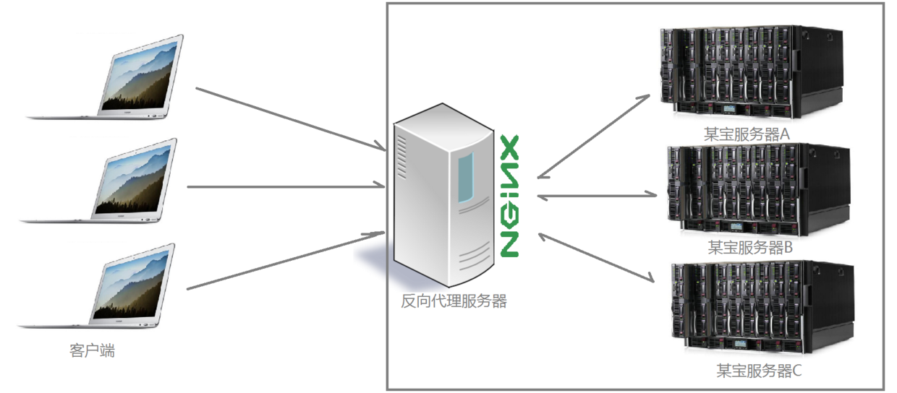

# 用途

## 概要

- `nginx`可以被用在很多地方，比如经常提到的“代理/正向代理/反向代理/邮箱服务器/负载均衡/静态资源服务器等”，但具体这些是些什么意思，这我之前不了解。

## Nginx

- 是一个异步框架的web服务器，由'Igor Syssoev‘创建并在2004年发布，2011年同名公司成立，并且在2019年被’F5 Networks‘收购。
- 具体功能如下：
	- 基本的HTTP服务器功能
	- 其他HTTP服务器功能
	- 邮件代理服务器功能
	- TCP/UDP代理服务器功能
	- 体系结构和可扩展性
	- 经测试的操作系统和平台
- Dropbox/Netfix/Wordpress/FastMail是商业公司在使用
- Nginx许可证是类BSD

## 代理

- 代理就如同生活中的专卖店，客人到专卖店买鞋子，这个专卖店就是代理，被代理的角色就是厂家，目标角色就是用户

## 反向代理

- 反向代理是用于优化传统的单节点服务器的，因为随着客户访问量增加，单个服务器已经无法支撑访问量了，所以出现了服务器的分布式部署，也就是通过部署多台服务器解决访问人数限制的问题，这个分布式访问的机制就是通过`Nginx`来实现的。具体如下图
- 
- Nginx接收到客户请求后按照一定规则分发给后端的业务处理服务器进行处理。
- 此时请求来源也就是客户端是明确的，但请求具体是由哪一台服务器处理的并不明确，这就是反向代理角色。
- 总结：反向代理，主要用于服务器集群分布式部署的情况下，反向代理隐藏了服务器信息。

## 正向代理

- 使用正向代理场景:国内访问国外网站时候，直接访问会被墙，访问失败，此时访问经由一个可以访问国外站点的节点(VPN)进行转发，等接收到目标服务器回复后节点再把信息转发给请求客户。
- 
- 正向代理特点:
	- 客户端非常明确要访问的服务器地址；
	- 服务器只清楚请求来自哪个代理服务器(VPN)，而不清楚来自具体哪个客户端；
	- 正向代理模式屏蔽或者隐藏了真实客户信息
- 正向代理和反向代理一起使用就是如下图
- 

## 负载均衡

- 客户端发送的，nginx反向代理服务器接收到的请求数量就是负载量
- 均衡:请求数量按照一定规则进行分发到不同服务器处理的规则
- 就是将服务器接收到的请求按照一定规则进行分发的过程
- 按照具体实现分为“硬件负载均衡”和“软件负载均衡”
	- 硬件：F5硬件，价格昂贵，数据的稳定性和安全性高
	- 软件: 价格低廉，灵活度高，通过现有技术结合主机硬件实现的一种消息队列分发机制
- 常用算法：
	- weight轮询:接收到的请求按照顺序逐一分配到不同的后端服务器，即使在使用过程中，某一台后端服务器宕机，nginx会自动将该服务器剔除出队列，这种方式下，可以给不同的后端服务器设置一个权重值，用于调整不同的服务器请求分配率；权重数据越大，被分配的请求几率越大；该权重值主要是针对不同服务器的硬件配置进行调整的。
	- ip_hash: 每个请求按照发起客户端的ip的hash结果进行匹配，这样的算法下一个固定ip地址的客户端总会访问到同一个后端服务器，这也在一定程度上解决了集群部署环境下`session`共享的问题。
	- fair: 只能调整调度算法，动态根据后端服务器的请求处理到响应的时间进行均衡分配，响应时间短处理效率高的服务器分配到请求概率高，是结合了前俩者优点的一种算法，
	- url_hash: 按照访问的url的hash结果分配请求，每个请求的url会指向后端固定的某个服务器，可以在nginx作为静态服务器的情况下提高缓存效率。
- 
- 
- 这种架构下，使用Nginx处理所有的"html/js/css"静态资源请求，Tomcat压力就会减轻一些，这样操作也能实现一定程度的负载均衡。

## 参考

- [Nginx基础学习](https://www.cnblogs.com/xingyunblog/p/9066865.html)
