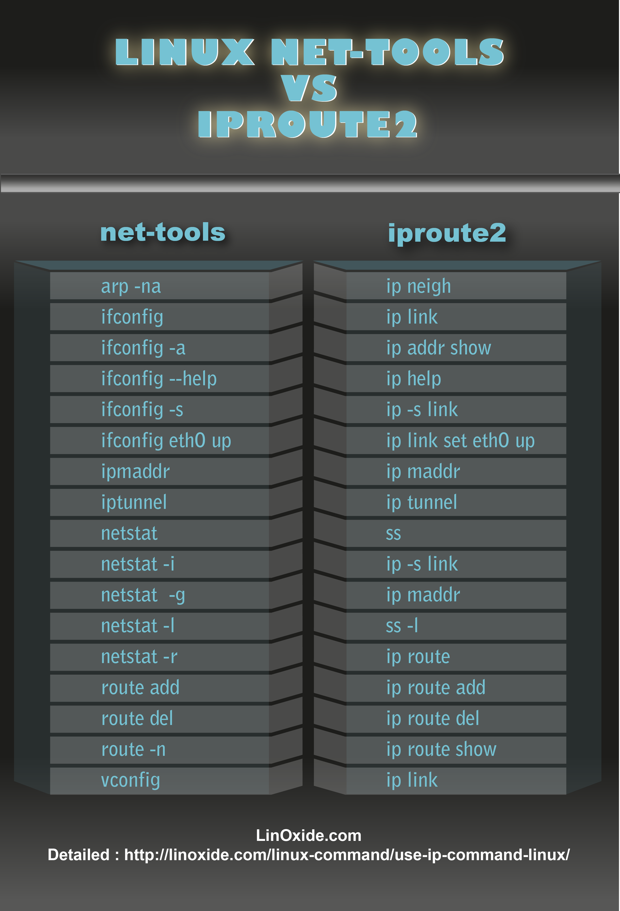

# ip_link

## 概要

- iproute2的工具包主要命令

## 常用命令

- `ip link show`
- `ip link show wlan0`
- `ip -s link show wlan0` 可以想ifconfig那样输出更多信息
- `ip link show up` 只显示激活网络接口
- `ip link set eth0 up` 激活网卡
- `ip link set eth0 down` 注销网卡
- `ip link set eth0 mtu 1500` 调整最大传输单元
- 修改网卡mac地址
	- `ip link set eth0 down` 先卸载网卡
	- `ip link set eth0 address b8:27:eb:18:88:50`
	- `ip link set eth0 up` 重新激活网卡
- 修改网卡名词
	- `ip link set eth0 down`
	- `ip link set eth0 name eth1`
	- `ip link set eth1 up`
	- 这样的修改只是临时的方案,如果机器重启会重新变更会eth0

- ifconfig and iproute2 compare
- 

## 参考

