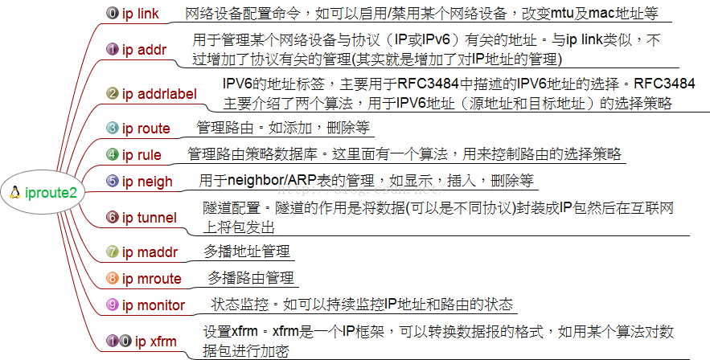

# iproute2

## 概要

- 之前对于网络的管理都使用工具net-tool `ifconfig/route`等分割的数个工具,但那是过时的而且工具本身已经不再维护
- iproute2是linux下管理控制TCP/IP网络和流量控制的新一代工具包,
- net-tools通过procfs(/proc)和ioctl系统调用去访问和改变内核网络配置
- iproute2则通过netlink套接字接口与内核通讯,性能完全不是一个级别,从查看route就可以看出来.
- 现在通过iproute2工具包来管理,这是现在新发行版默认配置的网络工具
- 
- iproute2的核心命令是ip

## 常用命令

- 显示ip地址
	- `ip a` 显示ip地址
	- `ip address show`
	- `ip addr show dev eth0`
- 增加删除地址
	- `ip address add 192.168.0.2/24 dev eth0`
	- `ip addr del 192.168.0.2/24 dev eth0`
- 显示统计接口
	- `ip -s link ls eth0`
- 网卡和链路配置
	- `ip link show` 显示链路
	- `ip link show wlan0` 查看无线网卡的链路
	- `ip link set eth0 up` 挂载网卡
	- `ip link set eth0 down` 卸载网卡
- 路由配置
	- `ip route` 显示所有路由信息
	- `ip route show dev wlan0` 只显示wlan0的路由
	- `ip route add default via 192.168.1.1` 添加默认路由
	- `ip route change default via 192.168.1.2` 修改默认路由
	- `ip route del default`
- 隧道配置
	- `ip tunnel show`
	- `ip tunnel del gre01`
- 查看arp表
	- `ip neigh show`
	- `ip neigh add 10.2.2.2 dev eth0`
	- `ip neigh del 10.2.2.2 dev eth0`
- 端口监听
	- `ss -l` 显示所有端口监听
	- `ss -nltp` 等效于 `netstat -nltp`
	- `ss -p` 显示当前所有的监听进程

## 参考

- [linux ip知识点盘点](https://www.cnblogs.com/0to9/p/9591315.html)
